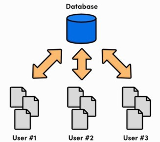
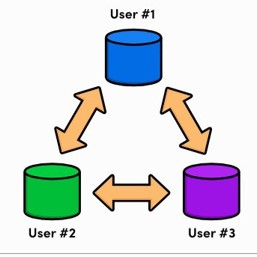
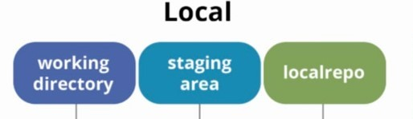
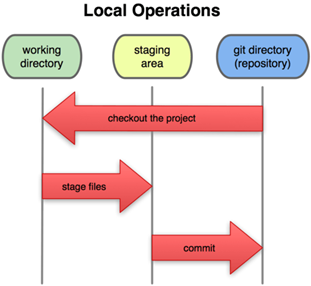
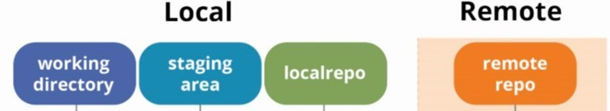
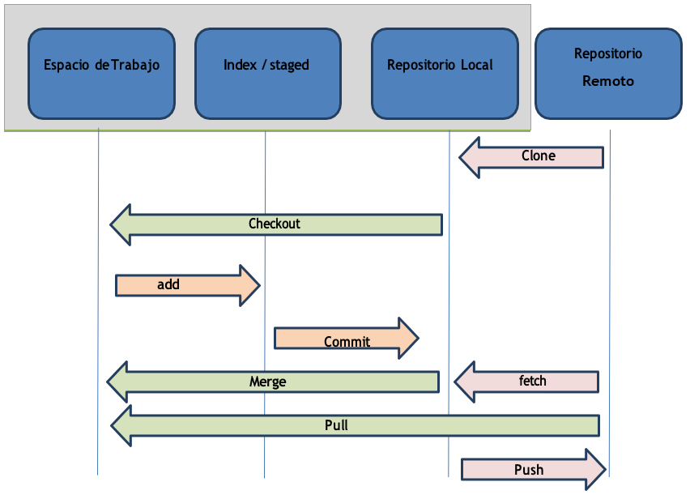

# UD3: Control de versiones

- [UD3: Control de versiones](#ud3-control-de-versiones)
  - [1. ¿Qué es el control de versiones?](#1-qué-es-el-control-de-versiones)
  - [2. Control de versiones en Java](#2-control-de-versiones-en-java)
  - [3. Git](#3-git)
    - [3.1 Arquitectura de Git](#31-arquitectura-de-git)
    - [3.2. Flujo de trabajo en Git](#32-flujo-de-trabajo-en-git)
    - [3.3. Git con repositorios remotos](#33-git-con-repositorios-remotos)
    - [3.4. Principales instrucciones de Git](#34-principales-instrucciones-de-git)
  - [4. GitHub](#4-github)

## 1. ¿Qué es el control de versiones?
Se llama __control de versiones__ a la gestión de los diversos cambios que se realizan sobre los elementos de algún producto o una configuración del mismo. Una versión, revisión o edición de un producto, es el estado en el que se encuentra el mismo en un momento dado de su desarrollo o modificación.

Aunque un sistema de control de versiones puede realizarse de forma manual, es muy aconsejable disponer de herramientas que faciliten esta gestión dando lugar a los llamados __sistemas de control de versiones__ o VCS (del inglés Version Control System). Estos sistemas facilitan la administración de las distintas versiones de cada producto desarrollado, así como las posibles especializaciones realizadas (por ejemplo, para algún cliente específico). Ejemplos de este tipo de herramientas son entre otros: CVS, Subversion, SourceSafe, ClearCase, Darcs, Bazaar, Plastic SCM, Git, SCCS, Mercurial, Perforce, Fossil SCM, Team Foundation Server.

Dentro de los VCS encontramos dos arquitecturas dependiendo de como se organice.
- __Arquitectura centralizada o cliente-servidor__: Un único servidor contiene todos los archivos versionados, y varios clientes acceden a este servidor para obtener y actualizar los archivos.

  Cuenta con un repositorio central al que se accede mediante un cliente en su máquina. Tiene un único servidor que contiene todos los archivos versionados, y varios clientes que descargan los archivos desde ese lugar central.

- __Arquitectura distribuida__: Cada usuario tiene una copia completa del repositorio. Esto significa que, si el servidor principal se pierde, cualquier usuario puede restaurarlo a partir de su copia.

  Cada usuario tiene su propio repositorio, por ello, cada vez que se descarga una versión del proyecto se hace una copia de seguridad completa de todos los datos. 
Así, si un servidor muere, cualquiera de los repositorios de los usuarios puede copiarse en el servidor para restaurarlo.
    

## 2. Control de versiones en Java
En los proyectos Java existen varios sistemas principales de control de versiones de código abierto:
- __CVS__ es una herramienta de código abierto que es usada por gran cantidad de organizaciones. 
- __Subversion__ es el sucesor natural de CVS, ya que se adapta mejor que CVS a las modernas prácticas de desarrollo de software. 
- __Git__ es un software de control de versiones diseñado pensando en la eficiencia, la confiabilidad y compatibilidad del mantenimiento de versiones de aplicaciones cuando estas tienen un gran número de archivos de código fuente. Profundizaremos en el resto de la unidad.

## 3. Git
Git es un sistema de control de versiones distribuido, gratuito y de código abierto, diseñado para manejar proyectos de cualquier tamaño con rapidez y eficiencia. Es fácil de aprender, ocupa poco espacio y tiene un rendimiento superior a herramientas como Subversion o CVS.

### 3.1 Arquitectura de Git
Aunque Git es un sistema distribuido, puede comportarse de manera centralizada al trabajar con un servidor remoto. Git organiza los archivos en tres estados:

- **Committed** (confirmado): Los datos están guardados de forma segura en el repositorio local.
- **Modified** (modificado): Los archivos se han modificado pero aún no se han preparado para el commit.
- **Staged** (preparado): Los cambios se han marcado para ser confirmados en el próximo commit.

Las tres áreas principales de un proyecto de Git son:

- **Git directory** (directorio de Git): Base de datos de objetos y metadatos. Aquí se almacenan las versiones confirmadas.
- **Working directory** (directorio de trabajo): Área donde editas los archivos. Proviene de una versión descomprimida del repositorio.
- **Staging area** (área de preparación): Espacio donde se preparan los archivos antes de confirmarlos.

Puedes encontrar toda la documentación sobre git en su web [git-scm.com](https://git-scm.com/)

### 3.2. Flujo de trabajo en Git

El flujo de trabajo en Git se basa en:
1. Modificar los archivos en el Directorio de Trabajo.
2. Preparar los archivos para el commit añadiéndolos al Área de Preparación.
3. Confirmar los cambios, guardando las instantáneas en el repositorio.

Los tres estados en los que se pueden encontrar un archivo en Git son:
- __Commited__ (confirmado): Los datos están almacenados de forma segura en el repositorio local.
- __Modified__ (modificado): Has cambiado el archivo, pero no lo has confirmado en el repositorio.
- __Staged__ (preparado): Has marcado un archivo modificado en su versión actual para que vaya en el próximo commit o confirmación que hagas.

Esto nos lleva a las tres secciones principales de un proyecto de Git serán:
- __Git directory__ (directorio de Git). Contiene base datos objetos y metadatos del proyecto. Es la parte más importante de Git, es lo que copiamos cuando clonamos el repositorio desde otro ordenador.
- __Working directory__ (directorio de trabajo). Es una copia de una versión del proyecto para poder trabajar. Estos archivos se obtienen de la base de datos comprimida en el Git Directory y se guardan en nuestro equipo local para poder editarlos.
- __Staging area__ (área de preparación o índice). Es un archivo que está en nuestro directorio de Git y almacena la información sobre lo que va a ir en la próxima confirmación. 

Por lo que podemos decir que:
- Las versiones de los archivos que están en el Directorio de Git se consideran Commited (confirmadas).
- Si la versión ha sufrido cambios desde que se obtuvo el repositorio y han sido añadidas al Área de Preparación, se considera Staged (preparada).
- Si los cambios no se han añadido al Área de preparación, está Modified (modificada).

### 3.3. Git con repositorios remotos

Para trabajar con un repositorio remoto es necesario conocer varios conceptos:
- __Origin__: nombre por defecto del repositorio remoto principal.
- __Master /Main__: nombre de la rama principal que se crea por defecto.
- __Head__: El commit en el que está el repositorio actualmente, suele ser el último commit de la rama principal.

### 3.4. Principales instrucciones de Git

Los principales comandos de Git son los siguientes:

- **checkout**: Cambiar entre ramas o actualizar el directorio de trabajo.
- **clone**: Clonar un repositorio remoto en tu máquina local.
- **add**: Añadir archivos modificados o nuevos al área de preparación.
- **commit**: Guardar los cambios preparados en el repositorio.
- **fetch**: Obtener cambios desde el repositorio remoto, sin fusionarlos.
- **pull**: Traer y fusionar cambios del repositorio remoto.
- **push**: Enviar cambios al repositorio remoto.

Puedes encontrar los comandos explicados con más detalle en el siguiente enlace: [instrucciones Git](instruccionesGit.md)

Para ampliar información y consolidar conceptos sobre Git es recomendable acudir a la documentación oficial ([git-scm.com](https://git-scm.com/)) y al libro de Git ([GitBook](https://git-scm.com/book/es/v2)).

## 4. GitHub
GitHub es una plataforma de desarrollo colaborativo para alojar proyectos utilizando el sistema de control de versiones Git. Se utiliza principalmente para el desarrollo de software. El código de los proyectos alojados en GitHub se almacena generalmente de forma pública.

El objetivo de GitHub es facilitar el trabajo colaborativo, que es aquel en el cual un grupo de personas intervienen aportando sus ideas y conocimientos con el objetivo de lograr una meta común.
El grupo puede ser desde un reducido equipo de trabajo para un proyecto empresarial o académico hasta grupos inmensos que colaboran en proyectos masivos.

Ver vídeo explicativo del funcionamiento de GitHub: [What is GitHub?](https://www.youtube.com/watch?v=w3jLJU7DT5E)

Puedes consultar más información sobre GitHub en su web [github.com](https://github.com/)